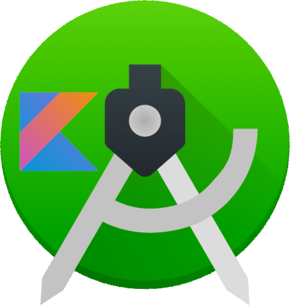

# CURSO DE ANDROID STUDIO EM KOTLIN
👨‍⚖️ANDROID STUDIO É UMA IDE CRIADA PARA DESENVOLVER APPS PARA ANDROID. KOTLIN É UMA LINGUAGEM DE PROGRAMAÇÃO.

  

## CONCEITO:
O Android Studio é um ambiente de desenvolvimento integrado (IDE) oficial para o desenvolvimento de aplicativos Android. Ele oferece uma série de ferramentas e recursos projetados especificamente para facilitar a criação, depuração e otimização de aplicativos móveis para a plataforma Android.

## HISTORIA:
O Android Studio foi anunciado pela primeira vez durante a conferência Google I/O em maio de 2013 e rapidamente se tornou a IDE preferida para desenvolvedores Android. Desde então, o Android Studio tem passado por várias atualizações e melhorias, mantendo-se como a principal escolha para o desenvolvimento de aplicativos Android.

## CARACTERISTICAS: 
### POSITIVAS:
- **Integração com o Android SDK**: O Android Studio vem com suporte integrado para o Android SDK, o que facilita a configuração do ambiente de desenvolvimento.
  
- **Interface de usuário intuitiva**: A interface do Android Studio é projetada para ser intuitiva e amigável, tornando mais fácil para os desenvolvedores navegarem e utilizarem todas as suas funcionalidades.
  
- **Ferramentas de desenvolvimento avançadas**: Ele oferece uma ampla gama de ferramentas avançadas, como depurador, analisador de desempenho, editor de layout, entre outras, que auxiliam os desenvolvedores no processo de desenvolvimento.

- **Suporte para Kotlin**: O Android Studio tem um excelente suporte para Kotlin, uma linguagem de programação moderna que se tornou a linguagem preferida para o desenvolvimento de aplicativos Android.

### NEGATIVAS:
- **Requisitos de hardware**: O Android Studio pode exigir recursos de hardware significativos, especialmente para projetos grandes, o que pode tornar a execução em máquinas mais antigas um pouco lenta.

- **Curva de aprendizado inicial**: Para desenvolvedores iniciantes, a curva de aprendizado inicial do Android Studio pode ser um pouco íngreme devido à grande quantidade de recursos e funcionalidades que ele oferece.

- **Atualizações frequentes**: Embora seja uma vantagem em termos de manter a IDE atualizada com as últimas tecnologias e recursos, as atualizações frequentes do Android Studio também podem ser inconvenientes para alguns desenvolvedores, especialmente se ocorrerem problemas de compatibilidade com plugins ou projetos existentes.

## SUBSIDIOS:
- [CURSO CRIADO PELO "BRUNO SANTOS"](https://youtube.com/playlist?list=PL50rZONmv8ZRsWj0L3rvSicPSEJl6sQ40&si=kGh_P6Dsh_3J2mJf)
- [CURSO FEITO PELO VILHALVA](https://github.com/VILHALVA)
- [VEJA A DOCUMENTAÇÃO](https://developer.android.com/docs?hl=pt-br)
- [LINGUAGEM DE PROGRAMAÇÃO KOTLIN](https://github.com/VILHALVA/CURSO-DE-KOTLIN) 
- [LINGUAGEM XML](https://github.com/VILHALVA/CURSO-DE-XML)
- [VEJA MAIS SUBSIDIOS](./SUBSIDIOS.md)
- [VEJA OS PROJETOS EM KOTLIN](https://github.com/VILHALVA?tab=repositories&q=topic:ANDROID-STUDIO+topic:KOTLIN)
- [VEJA TODOS OS PROJETOS](https://github.com/VILHALVA?tab=repositories&q=topic:ANDROID-STUDIO)